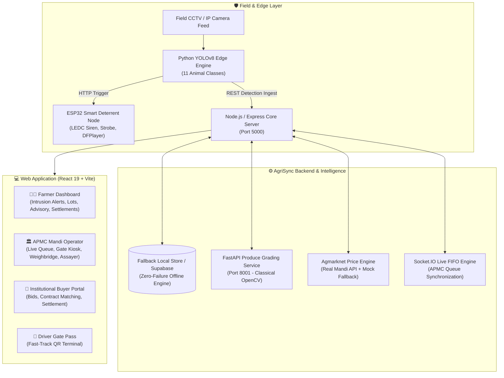

# 🌾 AgriSync — Unified Agricultural Protection & Market Platform


> **"Guard the Harvest. Value the Yield. Synchronize the Market."**
> An end-to-end national agricultural intelligence platform unifying **Pre-Harvest Wildlife Intrusion Defense**, **Classical CV Produce Quality Grading**, **APMC Mandi Yard Automation**, and **Dynamic Agmarknet Market Intelligence**.

---


---

## 🌟 Platform Overview

Smallholder farmers in India suffer losses at two critical ends of the agricultural supply chain:
1. **Pre-Harvest Crop Loss**: Up to 35% of standing yield is lost to nocturnal animal intrusions (wild boars, stray cattle, deer, nilgai) without early warning or targeted humane deterrence.
2. **Post-Harvest Value Leakage**: Asymmetrical market pricing, unscientific visual grading at APMC yards, uncoordinated mandi congestion, lack of rural cold storage access, and predatory distress selling.

**AgriSync (SIH26193)** bridges these divides through a single, cohesive platform designed for farmers, APMC mandi operators, assayers, gate security officers, and institutional buyers.

---

## 🏛️ System Architecture



---

## 🎯 Core Workflows & Key Modules

### 1. Pre-Harvest Intrusion Defense & IoT Deterrent
- **Real-Time Edge Detection**: Ultralytics YOLOv8 inference running on RTSP/IP camera streams, targeting 11 distinct wildlife classes (`cow`, `goat`, `pig`, `sheep`, `horse`, `dog`, `cat`, `bear`, `elephant`, `zebra`, `giraffe`).
- **Dynamic Risk Categorization**: Detections classified into `CRITICAL`, `HIGH`, `MEDIUM`, and `LOW` risk tiers with configurable farmer intrusion toggles.
- **Species-Specific Acoustic & Light Deterrent**: ESP32 microcontroller with dual-tone LEDC PWM frequencies (e.g. 12kHz–18kHz sweeps for wild boar, 800Hz/1500Hz for cattle, ultrasonic for canines), high-visibility strobe LEDs, and DFPlayer Mini MP3 predator roar sounds. Full hardware firmware and Wokwi simulation included.
- **Crop Incident Logging & Spatial Analytics**: Farmer-verified crop damage tracking with zone-level and temporal intrusion heatmaps.

### 2. APMC Mandi Yard Operations
- **Live FIFO Queue Console** (`/mandi/queue`): State-managed vehicle progression (`waiting` ➔ `in_progress` ➔ `completed`) with live queue metrics, token generation, and real-time Socket.IO synchronization.
- **ANPR Gate Security Terminal** (`/mandi/gate`): Camera-assisted optical number plate recognition terminal verifying driver QR passes, booking tokens, and driver identification before raising gate barriers.
- **Weighbridge Operator Console** (`/mandi/weighbridge`): Automated gross vehicle weight, tare vehicle weight, and net produce calculations with live weight scale simulation.
- **Digital Quality Assayer** (`/mandi/quality`): Moisture measurement, visual defect percentage calculation, and automated Mandi Lot Grade certification (`Grade A`, `Grade B`, `Grade C`).

### 3. Classical CV Produce Grading Microservice
- **FastAPI Computer Vision Engine** (`grading-service/`): High-throughput produce inspection using classical image processing techniques:
  - **HSV Color Segmentation**: Analyzes surface color uniformity and ripeness indices.
  - **Adaptive Defect Thresholding**: Detects surface blemishes, dark spots, and fungal rot.
  - **Contour Geometry Analysis**: Computes circularity, elongation, and symmetry metrics to determine shape regularity.
- **Transparent Output**: Returns quantifiable numerical scores (surface uniformity %, defect area %, geometric regularity %) without black-box hallucination.

### 4. Market Intelligence & Selling Window Advisory
- **Agmarknet Price Discovery**: Real-time mandi modal price tracking across Indian agricultural commodities with transparent data source tagging (`real` from data.gov.in / `mock` fallback).
- **Rule-Based Selling Window Decision Engine**: Computes price momentum gradients against crop perishable shelf-life decay curves, outputting plain-language advisory: `"Sell Now"` vs. `"Hold N Days"`.
- **Verified Buyer & FPO Matching**: Proximity, volume, and quality-scored matchmaker pairing farmers with bulk institutional purchasers.

### 5. Fulfillment, Warehousing & Settlement
- **Driver Fast-Track Gate Pass** (`/driver/gate-pass`): QR-coded digital gate pass containing commodity batch, net weight, vehicle registration, and destination verification.
- **Cold Storage & Rural Drayage Discovery**: Find accredited warehouse facilities, view temperature zones, and calculate financial holding ROI.
- **Transactions & Sauda Settlement Slips**: Complete accounting workflow tracking APMC trade transactions, payment modes (RTGS/e-Challan), and downloadable formal settlement receipts.

---


---

## 🛠️ Technology Stack

| Domain | Technology / Framework | Usage |
|---|---|---|
| **Web Frontend** | React 19, Vite 5, Tailwind CSS | High-performance, responsive operator & farmer dashboards |
| **Icons & Assets** | Lucide React, Google Material Symbols | Consistent agricultural iconography |
| **Backend API** | Node.js (v18+), Express 4 | Modular RESTful API and authentication services |
| **Real-Time Layer** | Socket.IO (v4) | Bidirectional live updates for APMC queue progression |
| **Data & Storage** | Supabase (PostgreSQL) + LocalStore Engine | Dual-mode persistence: cloud Postgres with offline fallback |
| **Edge AI Vision** | Python 3.10+, Ultralytics YOLOv8 | Real-time object detection on RTSP/IP camera streams |
| **Produce CV** | FastAPI, OpenCV (cv2), NumPy | Classical color space analysis, blemish segmentation, geometry |
| **IoT Hardware** | ESP32, C++ / Arduino, Wokwi, PlatformIO | Dual-frequency audio deterrents, strobes, hardware simulation |
| **Market Data** | Agmarknet (data.gov.in) REST API | Indian agricultural commodity price feed with mock fallback |

---

## 🚀 Quick Start & Local Setup

### Prerequisites
- **Node.js** v18.0.0 or higher
- **Python** 3.10 or higher
- **npm** v9 or higher

---

### Step 1: Clone the Repository
```bash
git clone https://github.com/kalolaTej/SIH26193.git
cd SIH26193
```

---

### Step 2: Start the Backend Server
```bash
cd backend
npm install
cp .env.example .env     # Pre-configured with local fallback defaults
npm run dev              # Or 'npm start'
```
*Backend runs on `http://localhost:5000` (Health check: `http://localhost:5000/api/health`)*

---

### Step 3: Start the Web Dashboard
```bash
cd ../web
npm install
cp .env.example .env     # Points VITE_API_URL to http://localhost:5000
npm run dev
```
*Frontend runs on `http://localhost:5173`*

---

### Step 4: Start the Classical CV Produce Grading Microservice (Optional)
```bash
cd ../grading-service
python -m venv venv

# Windows:
.\venv\Scripts\activate
# Linux/macOS:
source venv/bin/activate

pip install -r requirements.txt
uvicorn main:app --host 0.0.0.0 --port 8001 --reload
```
*Grading microservice runs on `http://127.0.0.1:8001` (Interactive Swagger Docs: `http://127.0.0.1:8001/docs`)*

---

### Step 5: Launch the Edge AI Detection Engine (Optional)
```bash
cd ../ai
pip install -r requirements.txt
python detect.py
```

---

## ⚡ Offline / Demo Mode Simulation

AgriSync incorporates an automated **LocalStore Fallback Engine** (`backend/database/localStore.js` and `backend/database/agrisync_store.json`).

- **Zero-Failure Evaluation**: If Supabase credentials or internet access are unavailable during hackathon evaluation, the backend automatically falls back to the local database file.
- **Full Operational State**: Pre-seeded with realistic produce lots, farmer profiles, camera feeds, APMC mandi queue entries, storage facilities, and trade transactions.
- **Hardware Simulation**: The ESP32 deterrent features complete serial command echoing (`DETER:pig`, `STOP`, `STATUS`) enabling full demonstration inside the browser via the Wokwi web simulator or serial monitor.

---

## 📡 API Reference

### Pre-Harvest & Animal Intrusion
| Method | Endpoint | Description |
|---|---|---|
| `GET` | `/api/cameras` | List perimeter camera nodes, status & battery levels |
| `POST` | `/api/cameras` | Register a new camera node |
| `GET` | `/api/detections` | Retrieve detection event feed (labeled `real` or `simulated`) |
| `POST` | `/api/detections` | Ingest edge YOLO detection event |
| `POST` | `/api/esp32/trigger` | Dispatch hardware deterrent trigger to ESP32 node |
| `POST` | `/api/esp32/stop` | Silence all active sirens and strobes |
| `GET` | `/api/incidents` | List crop damage incidents |
| `POST` | `/api/incidents` | Log farmer crop-loss incident |
| `GET` | `/api/incidents/analytics` | Fetch intrusion heatmaps by zone & period |

### APMC Mandi Operations & Quality Assaying
| Method | Endpoint | Description |
|---|---|---|
| `GET` | `/api/procurement/queue/:centre_id` | Live FIFO procurement queue list |
| `PATCH` | `/api/procurement/bookings/:id/advance` | Advance vehicle state (`waiting` ➔ `in_progress` ➔ `completed`) |
| `POST` | `/api/procurement/book-slot` | Reserve mandi yard arrival time-slot |
| `POST` | `/grade` *(FastAPI Port 8001)* | Classical OpenCV produce quality grading |

### Market Intelligence, Advisory & Logistics
| Method | Endpoint | Description |
|---|---|---|
| `GET` | `/api/prices` | Agmarknet commodity prices (with transparent `real`/`mock` tag) |
| `GET` | `/api/prices/trend` | Historical price trends across APMC mandis |
| `GET` | `/api/lots/:id/sale-window` | Rule-based "Sell Now" / "Hold" advisory |
| `POST` | `/api/sale-window/simulate` | Multi-day revenue vs. spoilage economic simulation |
| `GET` | `/api/lots/:id/matches` | Ranked buyer & FPO purchase matches |
| `GET` | `/api/lots/:id/logistics-suggestion` | Cold storage facility recommendation & ROI |
| `GET` | `/api/transactions` | List trade transactions and settlement records |
| `GET` | `/api/transactions/:id` | Fetch specific Sauda trade settlement detail |

---


## 👥 The AgriSync Team

Developed with pride for **Smart India Hackathon (SIH 2026)**.

| Contributor | Focus Area |
|---|---|
| **Aayush Barasara** | Pre-Harvest Edge AI, YOLOv8 Vision Pipeline & ESP32 Deterrent Hardware |
| **Tej Kalola** | Market Intelligence, Agmarknet API Integration, Selling Advisory & Logistics |
| **Krushn Kachhadiya** | Post-Harvest Core, OpenCV Grading Microservice & Queue Synchronization |
| **Vashishth Baraiya** | Full-Stack Integration, Role-Aware Routing, Navigation & UI System |

---
